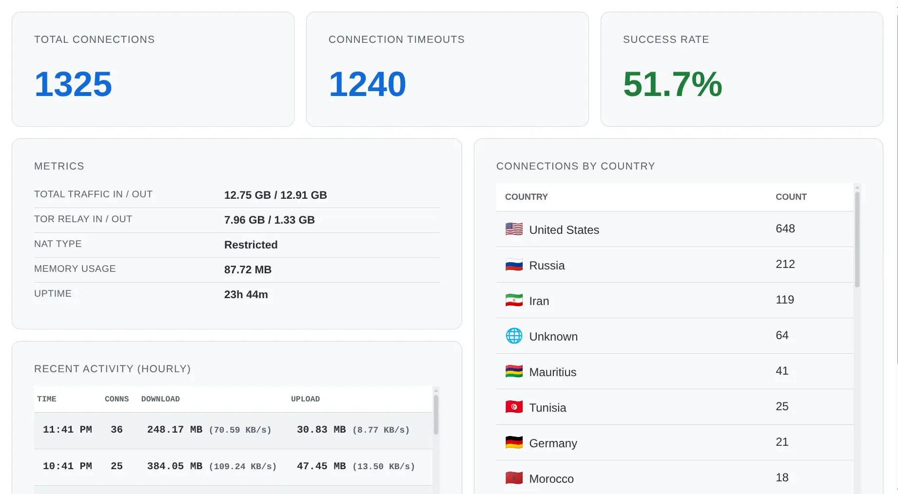
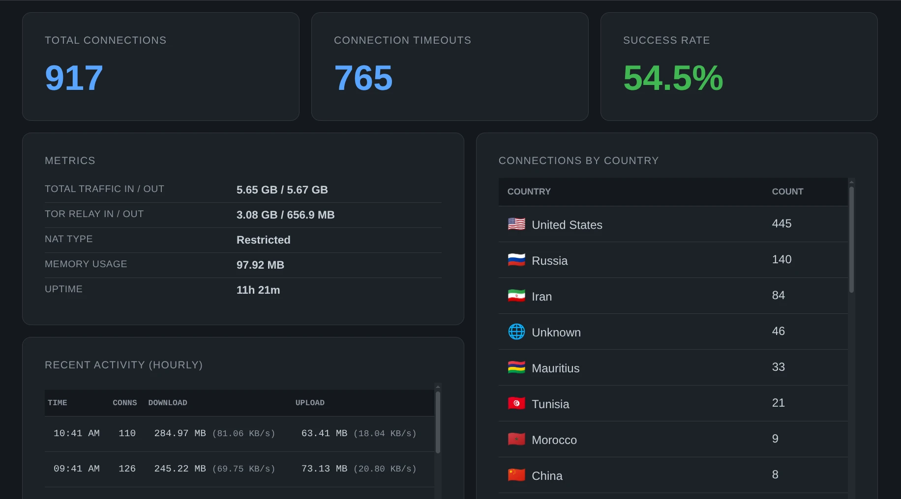

# Snowflake Dashboard

A simple [snowflake](https://snowflake.torproject.org/) dashboard to portray runtime metrics.

The dashboard uses data from snowflake's /internal/metrics endpoint and docker logs to display hourly totals. Its Built with Go and Alpine Linux for minimal resource usage (~23MB image, ~3MB RAM).

## Light Mode



## Dark Mode



## Installation

Download the `docker-compose.yml` file:

```bash
curl -O https://raw.githubusercontent.com/lone-cloud/snowflake-dashboard/main/docker-compose.yml
```

Start the services:

```bash
docker compose up -d
```

Open the dashboard in your browser:

```plaintext
http://localhost:8888
```
